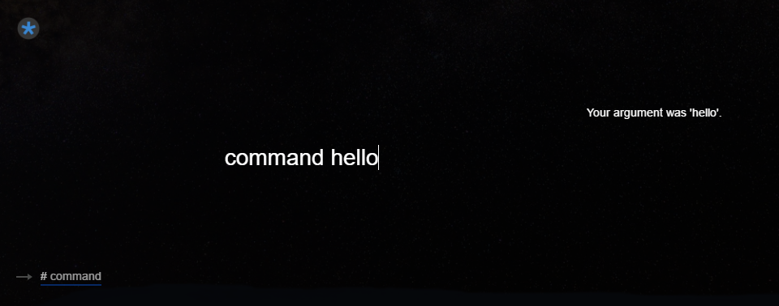

<!--TITLE:Runner-->
<!--ABOUT:The runner is the face of Upspark. Execute commands and observe results.-->

The three main sections of runner pictured above, from bottom left to top right are

- Command History
- Command Input
- Command Output

When opened or toggled, Upspark will focus on the command input.