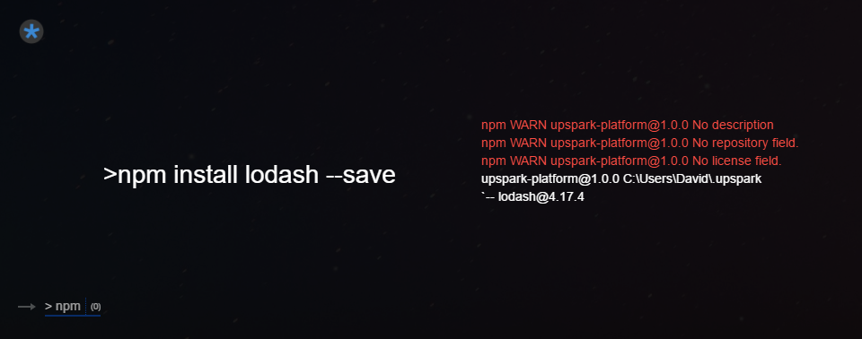

<!--TITLE:Packages-->
<!--ABOUT:Upspark can be expanded with NPM modules.-->

NPM and YARN commands can be run against the platform directory. This means, you can use any NPM module in your **platform.js** file.

For example, here's the command to install lodash -
```
npm install lodash --save
```

Then you can use lodash functionality with an import in platform.js
```javascript
import * as _ from 'lodash';
```

As a side note, you could've also used Upspark to install the module



